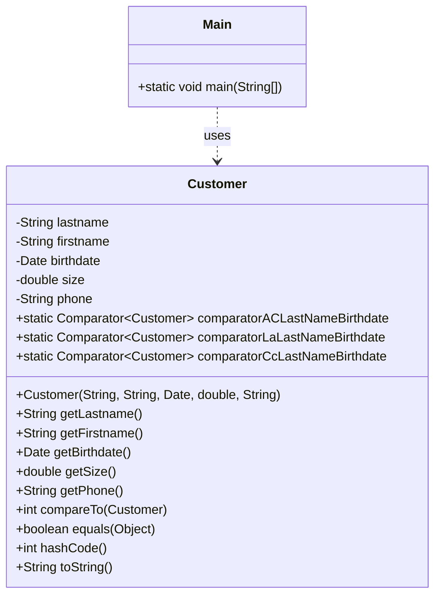

```mermaid
classDiagram
    class Customer {
        -String lastname
        -String firstname
        -Date birthdate
        -double size
        -String phone
        +Customer(String, String, Date, double, String)
        +String getLastname()
        +String getFirstname()
        +Date getBirthdate()
        +double getSize()
        +String getPhone()
        +int compareTo(Customer)
        +boolean equals(Object)
        +int hashCode()
        +String toString()
        +static Comparator~Customer~ comparatorACLastNameBirthdate
        +static Comparator~Customer~ comparatorLaLastNameBirthdate
        +static Comparator~Customer~ comparatorCcLastNameBirthdate
    }

    class Main {
        +static void main(String[])
    }

    Main ..> Customer : uses
```
