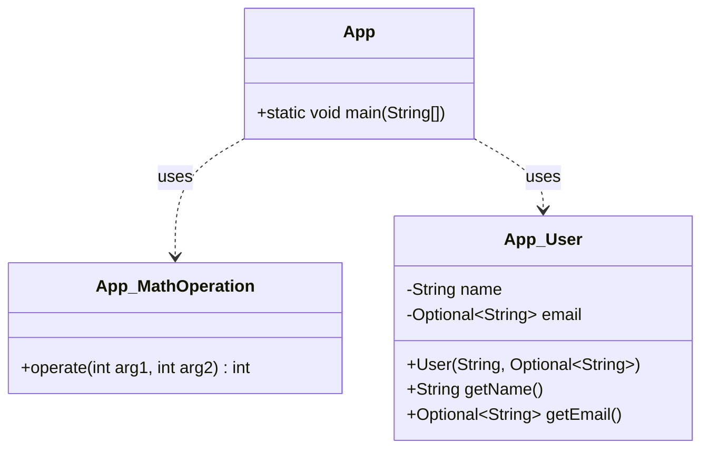

```mermaid
classDiagram
    class App {
        +static void main(String[])
    }
    class App_User {
        -String name
        -Optional~String~ email
        +User(String, Optional~String~)
        +String getName()
        +Optional~String~ getEmail()
    }
    class App_MathOperation {
        +operate(int arg1, int arg2) int
    }
    App ..> App_MathOperation : uses
    App ..> App_User : uses
```
