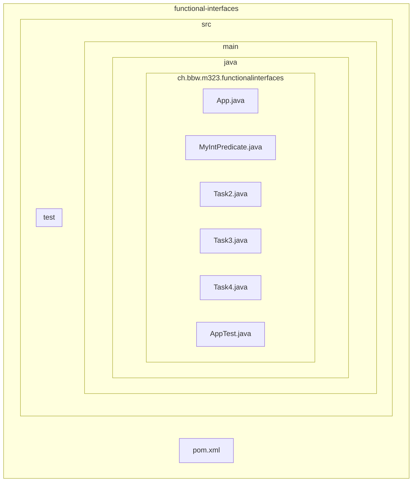
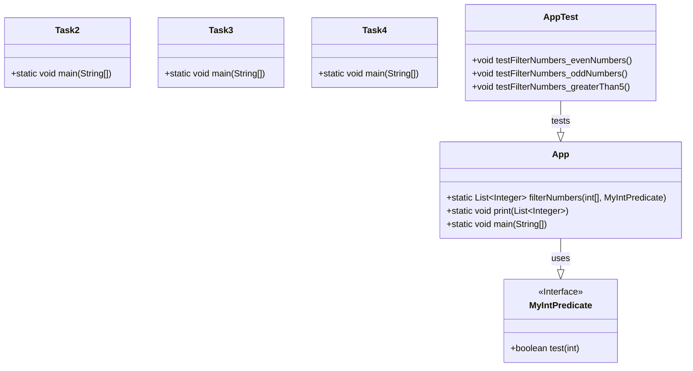

# Documentation

## Project Structure

## Classes and Methods

## Additional Tasks from PDF

### Aufgabe: Functional Interfaces aus `java.util.function`

| Functional Interface  | Erklärung                                                                                                             | Beispiel Methode des Interfaces        |
| --------------------- | --------------------------------------------------------------------------------------------------------------------- | -------------------------------------- |
| `Consumer<T>`         | Repräsentiert eine Operation, die ein einzelnes Argument entgegennimmt und kein Ergebnis zurückgibt.                  | `void accept(T t)`                     |
| `Function<T, R>`      | Repräsentiert eine Funktion, die ein Argument entgegennimmt und ein Ergebnis zurückgibt.                              | `R apply(T t)`                         |
| `DoubleFunction<R>`   | Repräsentiert eine Funktion, die ein double-wertiges Argument entgegennimmt und ein Ergebnis zurückgibt.              | `R apply(double value)`                |
| `BiFunction<T, U, R>` | Repräsentiert eine Funktion, die zwei Argumente entgegennimmt und ein Ergebnis zurückgibt.                            | `R apply(T t, U u)`                    |
| `Supplier<T>`         | Repräsentiert einen Lieferanten von Ergebnissen.                                                                      | `T get()`                              |
| `Predicate<T>`        | Repräsentiert ein Prädikat (boolesche Funktion) eines Arguments.                                                      | `boolean test(T t)`                    |
| `BinaryOperator<T>`   | Repräsentiert eine Operation auf zwei Operanden desselben Typs, die ein Ergebnis desselben Typs liefert.              | `T apply(T t1, T t2)`                  |
| `DoubleUnaryOperator` | Repräsentiert eine Operation auf einem einzelnen double-wertigen Operanden, die ein double-wertiges Ergebnis liefert. | `double applyAsDouble(double operand)` |

### Aufgabe: Methoden von `java.util.List`

| Methode von `List` | Erwartetes Functional Interface | Methode des Functional Interface |
| ------------------ | ------------------------------- | -------------------------------- |
| `sort`             | `Comparator<T>`                 | `int compare(T o1, T o2)`        |
| `forEach`          | `Consumer<T>`                   | `void accept(T t)`               |
| `removeIf`         | `Predicate<T>`                  | `boolean test(T t)`              |
| `replaceAll`       | `UnaryOperator<T>`              | `T apply(T t)`                   |

### Aufgabe: Methoden von `java.util.stream.Stream`

| Methode von `Stream` | Interface           | Methode des Interfaces |
| -------------------- | ------------------- | ---------------------- |
| `forEach`            | `Consumer<T>`       | `void accept(T t)`     |
| `map`                | `Function<T, R>`    | `R apply(T t)`         |
| `filter`             | `Predicate<T>`      | `boolean test(T t)`    |
| `reduce`             | `BinaryOperator<T>` | `T apply(T t1, T t2)`  |
| `count`              | -                   | -                      |
| `anyMatch`           | `Predicate<T>`      | `boolean test(T t)`    |
| `allMatch`           | `Predicate<T>`      | `boolean test(T t)`    |
| `noneMatch`          | `Predicate<T>`      | `boolean test(T t)`    |
| `findFirst`          | -                   | -                      |
| `findAny`            | -                   | -                      |

### Aufgabe: Einfache Anwendung mit Functional Interface

#### Addieren Sie zu einer Zahl 2 hinzu

- **Anforderung:** Erstellen Sie eine Lambda-Expression, die zu einer Zahl 2 addiert.
- **Lösung:** `Function<Integer, Integer> addTwo = x -> x + 2;`
- **Beispiel:** `addTwo.apply(5)` gibt `7` zurück.

#### Summe bis n

- **Anforderung:** Berechnen Sie die Summe der Zahlen von 1 bis n.
- **Lösung:** `Function<Integer, Integer> sumUpTo = n -> IntStream.rangeClosed(1, n).sum();`
- **Beispiel:** `sumUpTo.apply(5)` gibt `15` zurück.

### Aufgabe: Wachstum und Zerfall

#### Wachstum

- **Anforderung:** Eine Zahl `x` `n`-mal verdoppeln.
- **Lösung:** `BiFunction<Integer, Integer, Integer> growth = (number, doublings) -> { /* ... */ };`
- **Beispiel:** `growth.apply(3, 4)` gibt `48` zurück.

#### Zerfall

- **Anforderung:** Eine Zahl `x` `n`-mal halbieren.
- **Lösung:** `BiFunction<Integer, Integer, Integer> decay = (number, halvings) -> { /* ... */ };`
- **Beispiel:** `decay.apply(24, 3)` gibt `3` zurück.
