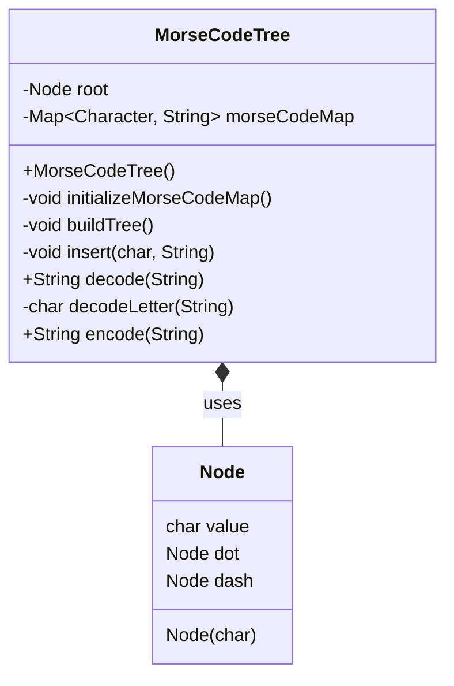

```mermaid
classDiagram
    class MorseCodeTree {
        -Node root
        -Map~Character, String~ morseCodeMap
        +MorseCodeTree()
        -void initializeMorseCodeMap()
        -void buildTree()
        -void insert(char, String)
        +String decode(String)
        -char decodeLetter(String)
        +String encode(String)
    }
    class Node {
        char value
        Node dot
        Node dash
        Node(char)
    }
    MorseCodeTree *-- Node : uses
```
