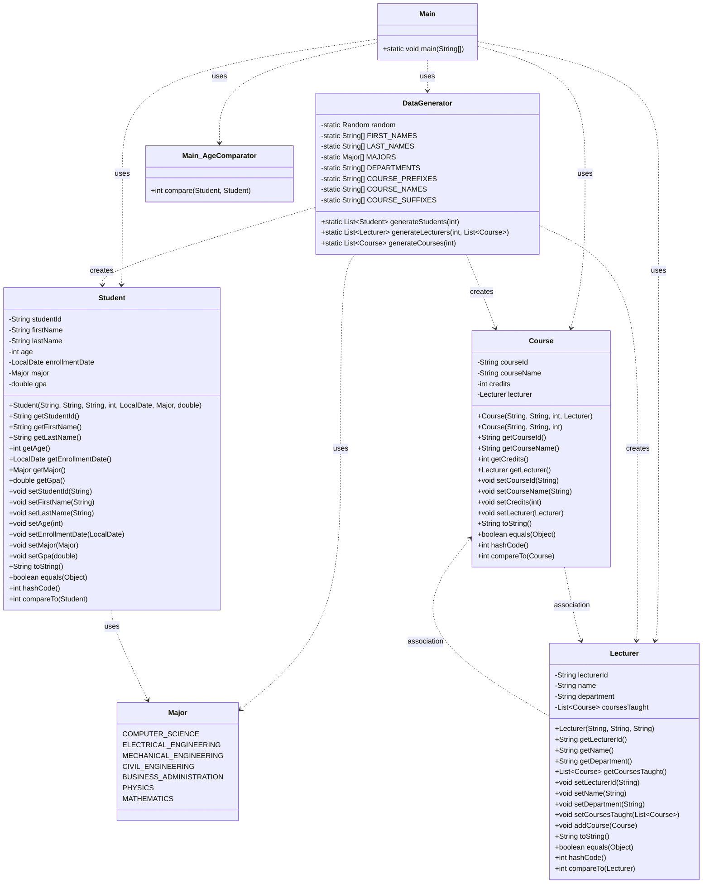

```mermaid
classDiagram
    class Course {
        -String courseId
        -String courseName
        -int credits
        -Lecturer lecturer
        +Course(String, String, int, Lecturer)
        +Course(String, String, int)
        +String getCourseId()
        +String getCourseName()
        +int getCredits()
        +Lecturer getLecturer()
        +void setCourseId(String)
        +void setCourseName(String)
        +void setCredits(int)
        +void setLecturer(Lecturer)
        +String toString()
        +boolean equals(Object)
        +int hashCode()
        +int compareTo(Course)
    }

    class DataGenerator {
        -static Random random
        -static String[] FIRST_NAMES
        -static String[] LAST_NAMES
        -static Major[] MAJORS
        -static String[] DEPARTMENTS
        -static String[] COURSE_PREFIXES
        -static String[] COURSE_NAMES
        -static String[] COURSE_SUFFIXES
        +static List~Student~ generateStudents(int)
        +static List~Lecturer~ generateLecturers(int, List~Course~)
        +static List~Course~ generateCourses(int)
    }

    class Lecturer {
        -String lecturerId
        -String name
        -String department
        -List~Course~ coursesTaught
        +Lecturer(String, String, String)
        +String getLecturerId()
        +String getName()
        +String getDepartment()
        +List~Course~ getCoursesTaught()
        +void setLecturerId(String)
        +void setName(String)
        +void setDepartment(String)
        +void setCoursesTaught(List~Course~)
        +void addCourse(Course)
        +String toString()
        +boolean equals(Object)
        +int hashCode()
        +int compareTo(Lecturer)
    }

    class Main {
        +static void main(String[])
    }
    class Main_AgeComparator {
        +int compare(Student, Student)
    }

    class Major {
        COMPUTER_SCIENCE
        ELECTRICAL_ENGINEERING
        MECHANICAL_ENGINEERING
        CIVIL_ENGINEERING
        BUSINESS_ADMINISTRATION
        PHYSICS
        MATHEMATICS
    }

    class Student {
        -String studentId
        -String firstName
        -String lastName
        -int age
        -LocalDate enrollmentDate
        -Major major
        -double gpa
        +Student(String, String, String, int, LocalDate, Major, double)
        +String getStudentId()
        +String getFirstName()
        +String getLastName()
        +int getAge()
        +LocalDate getEnrollmentDate()
        +Major getMajor()
        +double getGpa()
        +void setStudentId(String)
        +void setFirstName(String)
        +void setLastName(String)
        +void setAge(int)
        +void setEnrollmentDate(LocalDate)
        +void setMajor(Major)
        +void setGpa(double)
        +String toString()
        +boolean equals(Object)
        +int hashCode()
        +int compareTo(Student)
    }

    Main ..> DataGenerator : uses
    Main ..> Student : uses
    Main ..> Course : uses
    Main ..> Lecturer : uses
    Main ..> Main_AgeComparator : uses
    DataGenerator ..> Student : creates
    DataGenerator ..> Course : creates
    DataGenerator ..> Lecturer : creates
    DataGenerator ..> Major : uses
    Student ..> Major : uses
    Course ..> Lecturer : association
    Lecturer ..> Course : association
```
