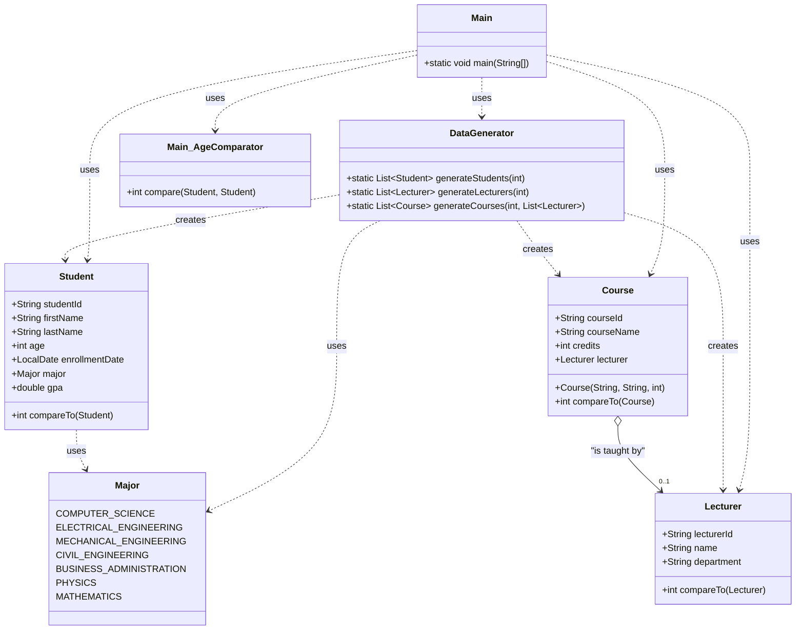

```mermaid
classDiagram
    class Student {
        +String studentId
        +String firstName
        +String lastName
        +int age
        +LocalDate enrollmentDate
        +Major major
        +double gpa
        +int compareTo(Student)
    }

    class Lecturer {
        +String lecturerId
        +String name
        +String department
        +int compareTo(Lecturer)
    }

    class Course {
        +String courseId
        +String courseName
        +int credits
        +Lecturer lecturer
        +Course(String, String, int)
        +int compareTo(Course)
    }

    class Major {
        COMPUTER_SCIENCE
        ELECTRICAL_ENGINEERING
        MECHANICAL_ENGINEERING
        CIVIL_ENGINEERING
        BUSINESS_ADMINISTRATION
        PHYSICS
        MATHEMATICS
    }

    class DataGenerator {
        +static List~Student~ generateStudents(int)
        +static List~Lecturer~ generateLecturers(int)
        +static List~Course~ generateCourses(int, List~Lecturer~)
    }

    class Main {
        +static void main(String[])
    }

    class Main_AgeComparator {
        +int compare(Student, Student)
    }

    Main ..> DataGenerator : uses
    Main ..> Student : uses
    Main ..> Course : uses
    Main ..> Lecturer : uses
    Main ..> Main_AgeComparator : uses

    DataGenerator ..> Student : creates
    DataGenerator ..> Course : creates
    DataGenerator ..> Lecturer : creates
    DataGenerator ..> Major : uses

    Student ..> Major : uses
    Course o--> "0..1" Lecturer : "is taught by"
```
