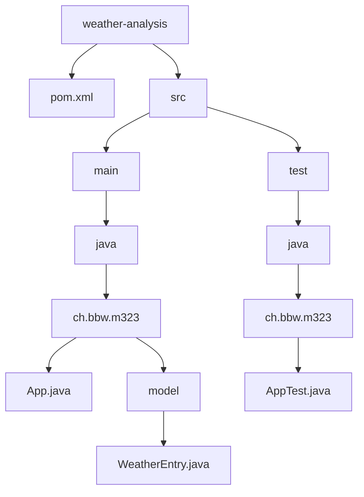

# Weather Analysis Project

This project analyzes weather data from a CSV file, calculates the average temperature for each weather condition, and displays the results in a bar chart.

## Project Structure

## Classes

### `App.java`

The main class of the application. It is responsible for:

- Reading the weather data from `sample_weather_data.csv`.
- Using Java Streams to process the data.
- Calculating the average temperature for each weather condition.
- Creating a bar chart using the JFreeChart library.
- Displaying the chart in a window.

### `model/WeatherEntry.java`

A data class representing a single entry (row) from the weather data CSV file.

### `AppTest.java`

Contains unit tests for the application, verifying the data parsing logic.
